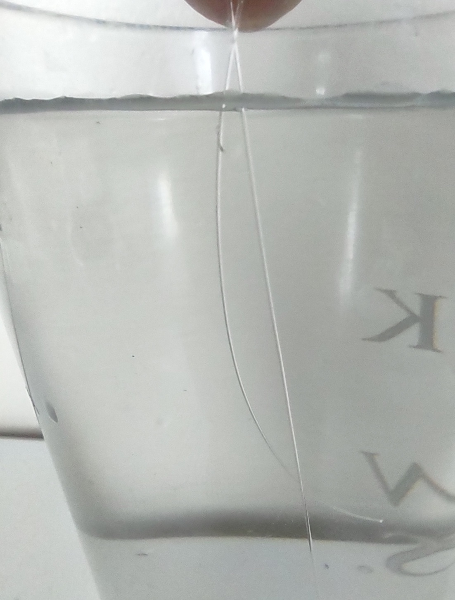
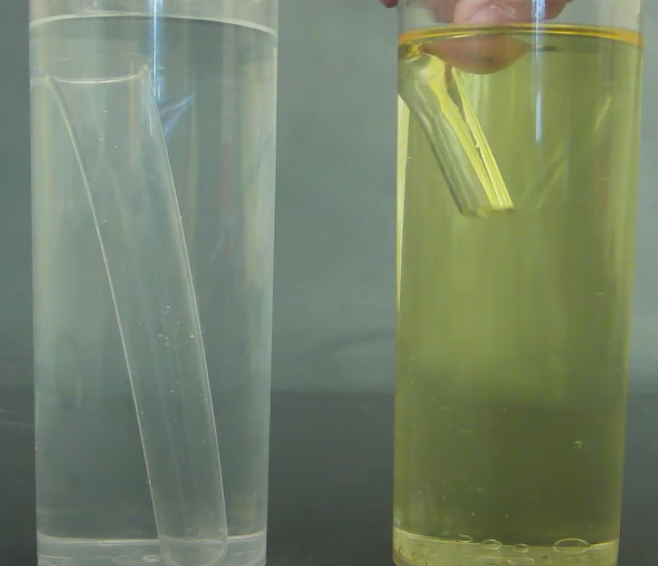

# About

In this notebook, I use physics to mathematically model the visibility of fishing lines submerged in fresh water.  The models suggest nylon (monofilament) and fluorocarbon lines have similar underwater visibilities in fresh water, when comparing lines of the same diameter. The findings do not support marketing claims that fluorocarbon lines are invisible in water, or less visible than nylon lines.  See the [LineVisibilityModeling.ipynb](LineVisibilityModeling.ipynb) for details.

#### Example:  
Below, I show a picture of flourocarbon and nylon lines of similar diameters submerged in water. The fluorocarbon is clearly not invisible, and the two lines appear to have similar visibilities, which are key results indicated by the physics models.

In contrast, in the screenshot below (from this [YouTube video](https://www.youtube.com/watch?v=9Tj2KMZhfoc)), the test tube on the right shows what actual invisiblity looks like, which happens when indices of refraction match very closely. The test tube on the left shows what non-invisiblity looks like, which occurs when indices of refraction are too disimilar. From this example, it seems pretty clear that fluorocarbon line in water is visible (like the left tube in the image below), and clearly not invisible (like the right tube below). In other words, the index of refraction of fluorocarbon is too different from water for fluorocarbon to be invisible.

